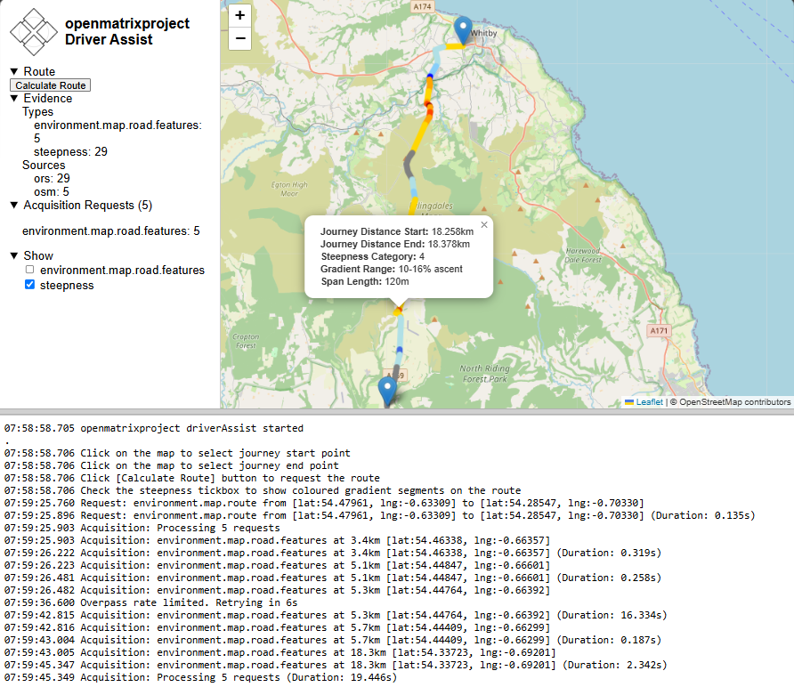

# Driver Route and Journey Assistant.

## Screenshot (Early Stage Development)

## Usage

Create a file: `js/config.js` which contains:

`export const ORS_API_KEY = '.....';`

Get your free api key from Open Route Service API web site.

https://api.openrouteservice.org/

## Project Objective

The objective is not to build a route planner.

The objective is to build an observable, self-optimsing, evidence-driven inference engine that can:

Acquire Evidence
    ↓
Analyse
    ↓
Identify Uncertainty
    ↓
Acquire More Evidence
    ↓
Converge Towards Useful Conclusions

for both:

Static Route Planning

and

Live Journey Guidance

using the same architecture.

## Development Methodology

### Principle 1

Observe → Verify → Refine

Implement
    ↓
Observe
    ↓
Verify
    ↓
Commit

Every significant feature becomes visible before becoming sophisticated.

### Principle 2

The engine is built using the same process it will eventually perform.

Observe
    ↓
Analyse
    ↓
Refine
    ↓
Observe

This applies to both the development process and the eventual runtime behaviour.

## Data Architecture

### Principle 3

Evidence is the primary knowledge store.

route.evidence contains facts.

Everything else derives from facts.

### Principle 4

Do not join on the way in.

Evidence remains independent.

Examples:

Steepness
Roads
Weather
Traffic
User Annotations
Vehicle Profile

are stored separately.

### Principle 5

Join at query time.

Questions are answered by querying overlapping evidence.

Not by building increasingly complex ingestion structures.

### Principle 6

Evidence is distance based.

Evidence references:

startM
endM

not route coordinate indexes.

Journey distance is the common coordinate system.

### Principle 7

Evidence is extensible.

Adding a new evidence source should not require redesigning the existing model.

## Reasoning Architecture

### Principle 8

Inference nodes are persistent evaluators.

They are not one-shot tasks.

Evidence Changes
        ↓
Node Re-evaluates

### Principle 9

Inference nodes are fixed shape.

Each node defines:

What evidence it cares about

and

How it reasons

The evidence changes.

The node does not.

### Principle 10

Node logic remains imperative.

Do not attempt to create a reasoning language.

Use JavaScript.

Use helper functions.

Use maths.

Use normal code.

### Principle 11

Reasoning is observable.

The user should be able to answer:

Why was this conclusion reached?

## Acquisition Architecture

### Principle 12

Analysis requests capabilities.

Not providers.

For example:

Need Road Classification
Need Weather and variability at location
Need lowest fuel price within range along route

not:

Call OSM (Open Street Maps)

### Principle 13

Provider selection belongs to the acquisition layer.

Analysis should not know:

ORS
OSM
LocationIQ
Weather Provider

### Principle 14

Acquisition requests represent information needs.

They are not execution instructions.

## Evidence Evolution

### Principle 15

Evidence may be observed or predicted.

Examples:

Observed GNSS Position
Forecast Weather
Traffic Prediction

are all evidence.

### Principle 16

Evidence may become stale.

Evidence may eventually carry:

acquiredAt

and related metadata.

### Principle 17

Evidence has scope.

Scope may be:

Local
Route Wide
Regional
Global

### Principle 18

Evidence may have volatility.

Some evidence changes rapidly.

Some rarely changes.

Acquisition behaviour should eventually adapt to this.

## Derived Knowledge

### Principle 19

Inference may create new evidence.

Examples:

Commitment Point (point of no return from an elevated risk area)
Turning Opportunity
Hazard Region
Alternative Route

are not raw map facts.

They are derived facts.

### Principle 20

Derived evidence is first-class evidence.

The system reasons over derived evidence exactly as it reasons over raw evidence.

## Explainability

### Principle 21

Reasoning lineage matters.

The engine should eventually be able to explain:

Weather
    +
Steep Descent
    ↓
Hazard
    ↓
Alternative Route

### Principle 22

Reasoning depth matters.

Derived outputs should carry:

Analysis Level

or equivalent lineage information.

### Principle 23

Runaway reasoning must be visible.

Depth should be measurable.

Not hidden.

## Optimisation Objectives

### Principle 24

Convergence is a first-class metric.

The engine should know whether conclusions are stabilising.

### Principle 25

Cost is a first-class metric.

Not all evidence acquisition has equal cost.

### Principle 26

Confidence is a first-class metric.

The engine should quantify uncertainty.

### Principle 27

The engine should optimise for:

Confidence Gain
        ÷
Cost

rather than blindly pursuing more evidence.

### Principle 28

The goal is not perfect knowledge.

The goal is useful knowledge.

The engine should stop when:

Further refinement
is not worth the cost.

## Long-Term Vision

### Principle 29

Route planning and journey guidance are the same system.

The difference is:

Static Data

versus

Live Data

not architecture.

### Principle 30

The engine reasons about options, not merely hazards.

The important question is often:

What are my remaining choices?

rather than:

What is the problem?

### Principle 31

The engine should adapt to the user profile.

A route suitable for:

Car

may be unsuitable for:

Car + Touring Caravan

The user's capabilities and constraints are evidence.

### Principle 32

Each UI concept has one owner.

For example:

The map owns the cursor position.
The geocoder owns the address.
The route owns the distance.
The inference engine owns the best current conclusions.
The application workflow owns the engine state.
Each segment of the status bar is owned by a single contributor

## Notes and Observations

### Information, Logging and Metrics 

Metrics describe current state.  They are summary in nature and relate to top-level concepts.

The inference log describes how the current state was reached.  They are detailed in nature and relate to the journey of inference from evidence through reasoning to The best current conclusion.

The sidebar is a metrics and control area.

The inference log should likely live elsewhere.

The inference log records historical events.

The status bar reports current operational state.

Both are distinct from metrics panels.

*Metrics*: What is true now?
*Status*: What is happening now?
*Log*: What happened?
*Map*: Where is it happening?

### Solution Space: Domains

**User**
route and risk preferences
vehicle characteristics

**Environment: Mapping**
 geometry, points of interest (escape routes, road characteristics, turning spaces, road widths, petrol stations etc.) 

**Environment: Weather**
4D: location, measure type (temperature, rain, wind, ice, snow, visibility, fog), measure volatility (rate of change), time (when you would arrive at that point in the journey) 

**Environment: Traffic**
time, predicted congestion/speed, incidents, closures/restrictions

**Base Evidence: Providers**
The same type of Feed data can come from a number of sources.  It is not necessary to choose only one, but where more than one exist in the evidence, agreement and differences will exist, uncertainty is an important measure when this occurs. 

### Solution Space: Dimensions

Many of the domain evidence types form natural relationships with certain dimensions and as such should be sliceable accordingly using a consistent methodology.

**Location**
Where

**Time**
When

**Provider**
Who from

## To condense everything into a single statement, it would be:

Build an observable, evidence-driven inference engine that incrementally acquires knowledge, quantifies uncertainty, optimises its own refinement cost, and converges towards useful, explainable, context-specific guidance for a particular vehicle, user and journey.

## AI Agent / Assistant Conversations

### Suggestions

Apply these project principles when making suggestions.
Suggest the next one or two next most useful, verifiable steps.
Seek consensus on verification before proceeding with further steps.
